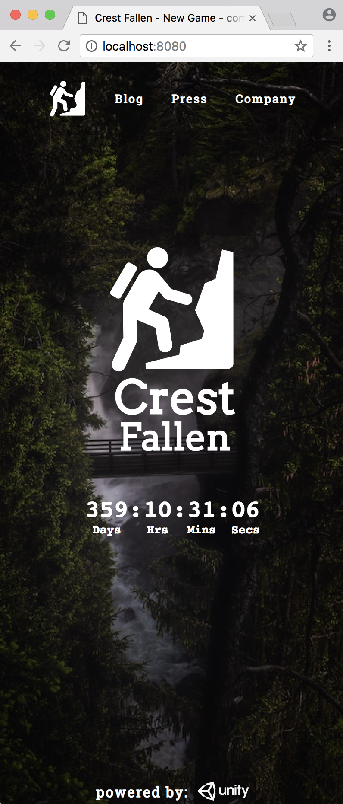
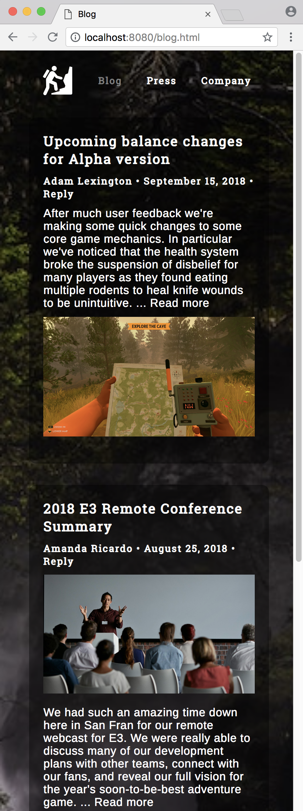
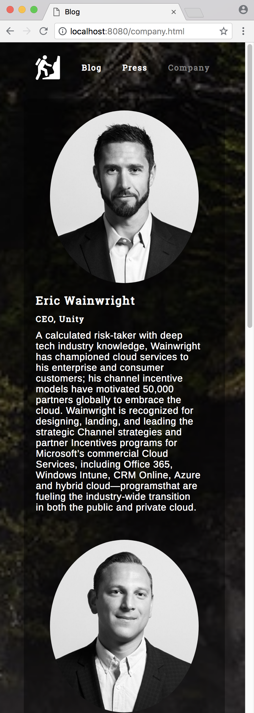

# Crest Fallen

#### By _**Kendra Kelly**_

## Description
This project is to build a trendy shoe site & branding. Used to practice with media queries and responsive design.

## Basis
A small rag-tag group of Unity developers are working on their latest video game about a hiker that gets lost in Oregon on the Pacific Crest Trail, and must use their skills and limited resources to survive. They're anticipating releasing in the next year, so they want to start advertising and drumming up anticipation online. The developers are too busy coding their actual game to worry about a website, so they've hired you.

## Brand Identity
* They mention they're really proud of being a small indie game company. They want that to be evident in all their content too.
* Their game involves a lot of forest and nature scenery. They think it'd be cool if this imagery and color palette was reflected on the site too.
* But they make a point to emphasize, "the game is a little dark at times..." so they want to avoid nature scenery feeling too quaint or peaceful. "It should be a tiny bit ominous. Maybe foreboding. You know?"

## Content
* Prominently-featured countdown timer, ticking down to when game is released.
* Page or area they can later feature media coverage and reviews as it starts trickling in.
* Highly-responsive pages that gracefully adapt to phone, tablet, and desktop screen sizes. They know their target demographic often uses a multitude of different devices to browse the web.
* Area featuring the small team of developers behind the game.
* Blog area where developers can give updates on development, later discuss new features and patches after the game is released, etc.
* Lots of images featuring the game's graphics (Feel free to use placeholder images, of course!)

## Setup/Installation Requirements
Using Command Line:
1. ``git clone https://github.com/coffeeringsdesign/crest-fallen-indie-game.git `` to clone the site.
2. ``cd ~`` to navigate to base directory
3. ``cd Desktop `` to navigate to your desktop
4. ``cd crest-fallen-indie-game`` to enter the site folder
5. ``npm init -y`` to initialize node
6. ``npm install`` to install all webpack dependencies
7. ``npm run start`` this will webpack and immediate pop open the site on your brower. I recommend Chrome.
8. Use Atom to edit any html, javascript, or sass.

## Final Screen Shots

Large Screen Screenshots | Mobile Screenshots
---------------------- | -----------------------
 | 
 | 
 | 

## Support and contact details

Please feel free to get in touch. Reach out to me at kendra@coffeeringsdesign.com.

## Technologies Used

Javascript, Webpack, Sketch, Bootstrap, Sass, JQuery, & Atom.

### License

*MIT*

Copyright (c) 2018 **Kendra Kelly**
